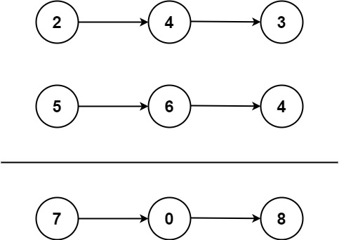

# 主題: 2. Add Two Numbers
---
###### tags: leetcode Medium

##### 類型:Linked List、Math、Recursion

---
## 題目大要:
給定2個non-empty(不為空)的Linked Lists，裡面的元素皆為正整數，以Reverse形式儲存，每個節點儲存一個個位數，相加之後以Linked List形式回傳結果。

Example 1:
Input: l1 = [2,4,3], l2 = [5,6,4]
Output: [7,0,8]
Explanation: 342 + 465 = 807.


Example 2:
Input: l1 = [0], l2 = [0]
Output: [0]

Example 3:
Input: l1 = [9,9,9,9,9,9,9], l2 = [9,9,9,9]
Output: [8,9,9,9,0,0,0,1]

---
## 解法(演算法):

計算的時候往右邊進位，將進位值與每位數值加總。

* ex:計算123+912，依高到低位元計算1+9,2+1,3+2，如果結果>=10，進位1到下一位計算(carry=True)，最終結果為1035。


```C++
/* p指向l1、q指向l2、r指向l3 的head */
// 檢查ListNode1與ListNode2的Node數量
len(l1),len(l2);
if( l1長度>l2長度 ) // l2比較短
  l2補(l1-l2)個0;
}
else{ //l1比較短
  l1補(l2-l1)個0;
}

carry = false; // 初始無進位
/* 建構一個新ListNode l3，計算相加與進位的結果 */
while(p!=NULL && q!=NULL){
  result = carry + l1.value + l2.value;
  /* 將這次result的個位數append到r的下一個Node */
  r->next = new ListNode(result%10);
  /* result>=10，進位(carry=1) */
  (carry = result>=10) ? True : false;

  // 過一輪，每個節點往後挪一位
  q=q->next,p=p->next,r=r->next;
}
if (result >=10){ //最後結果有進位
  result = new ListNode(1); // 往後一個節點補1
  r = r->next;
}
retrun l3;
```


---
## 程式碼(C++)
```C++
/**
 * Definition for singly-linked list.
 * struct ListNode {
 *     int val;
 *     ListNode *next;
 *     ListNode() : val(0), next(nullptr) {}
 *     ListNode(int x) : val(x), next(nullptr) {}
 *     ListNode(int x, ListNode *next) : val(x), next(next) {}
 * };
 */
class Solution {
public:
    ListNode* addTwoNumbers(ListNode* l1, ListNode* l2) {
        int sum = 0;
        ListNode *l3 = new ListNode(0);
        ListNode *r = l3;
        ListNode *p = l1;
        ListNode *q = l2;
        int len1=1,len2=1;
        /* ListNode1長度 */
        while(p->next!=NULL){
            len1++;
            p=p->next;
        }
        /* ListNode2長度*/
        while(q->next!=NULL){
            len2++;
            q=q->next;
        }
        /* 比較ListNode1與ListNode2長度 */
        if(len1>len2){ // L1比L2長，L2補0，使長度L1=L2
            for(int i=1;i<=len1-len2;i++){
                q->next = new ListNode(0);
                q = q->next;
            }
        }
        else{ // L2比L1長，L1補0，使長度L1=L2
            for(int i=1;i<=len2-len1;i++){
                p->next = new ListNode(0);
                p = p->next;
            }
        }

        p = l1; // p指回L1的head
        q = l2; // q指回L2的head
        bool carry = false; // 進位，預設值為false(0)
        int result = 0; // 每個位數相加結果
        while(p!=NULL && q!=NULL){
            // 將carry、q與p的目前值做相加
            result = carry + q->val + p->val;
            // 取個位數值，append到下一個節點
            r->next = new ListNode(result%10);
            // 相加有十位數，carry=1，否則carry=0
            if (result>=10)
                carry = true;
            else
                carry = false;

            // 所有ListNode往下一個節點移動
            r = r->next;
            p = p->next;
            q = q->next;
        }
        /* 當最後一個數值時，檢查是否有進位，若有則append(1)到下一個節點*/
        if(carry==true){
            r->next = new ListNode(1);
            r = r->next;
        }
        /* 回傳L3的head(結果) */
        return l3->next;
    }
};
```
