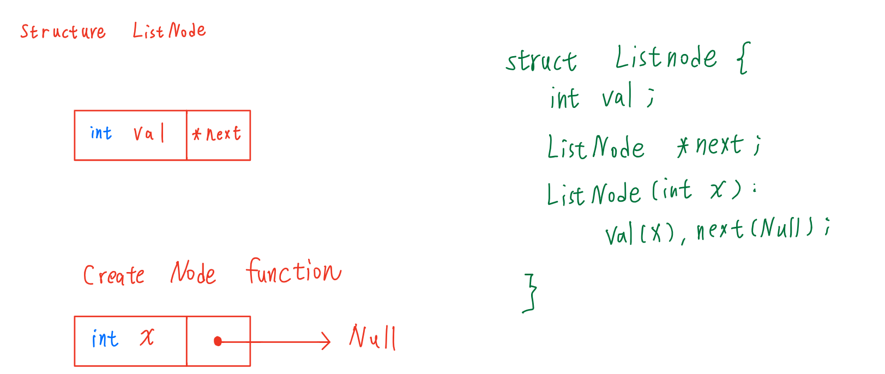
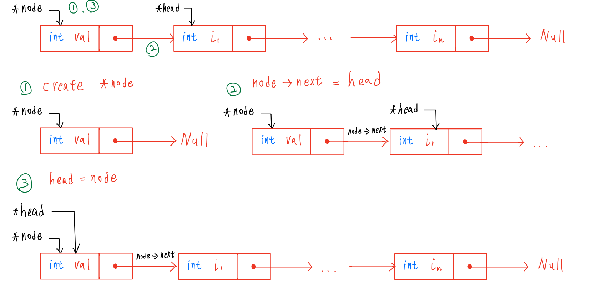
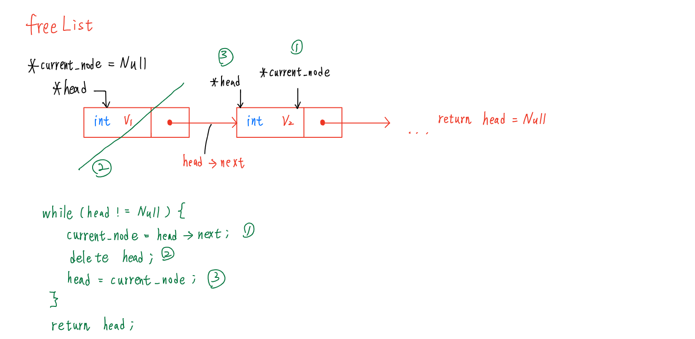
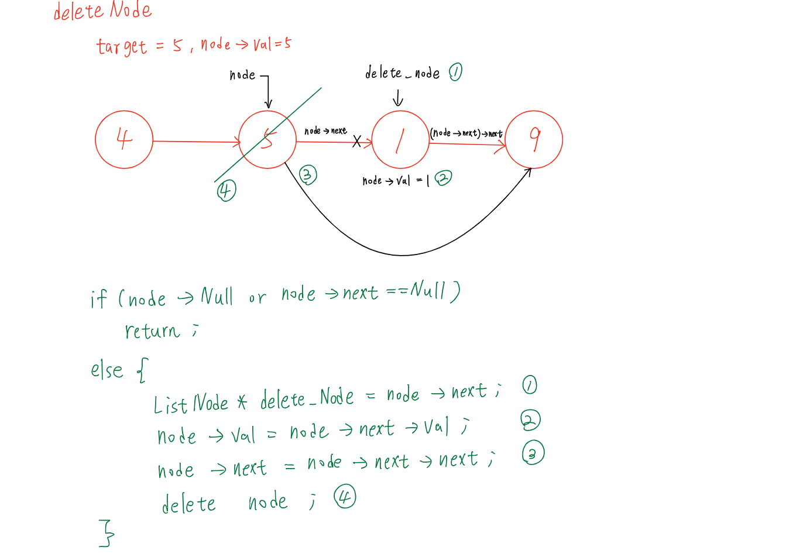

##### struct ListNode
```C++
//node結構，以下是"基本"操作
struct ListNode{
    int val;
    ListNode *next;
    //初始化建構一個Node
    ListNode(int x) : val(x), next(NULL){}
};
```


##### insertFromHead
```C++
//建立List，從頭插入，所以傳入List的Head Node與插入的資料
ListNode* insertFromHead(ListNode *head, int val) {
	ListNode *node = new ListNode(val); //插入以val為資料的Node(先建構出來)
	node->next = head;					//將新node成為Head (new node => ori head)
	head = node;						//List為空沒差，剛好new node => NULL
	return head;
}
```


##### insertFromTrail
```C++
//建立List，從尾巴插入
ListNode* insertFromTrail(ListNode *head, int val) {
	ListNode *current_node = head;			//先將當前Node = Head
	ListNode *node = new ListNode(val);		//插入以val為資料的Node(先建構出來)

	if (head == NULL) //檢查List是否為空，Yes則head = new node
		head = node;
	else {
		//No，則將Current node指向最後一個Node
		while(current_node->next)	//最後一個Node=>next為空
			current_node = current_node->next;

		current_node->next = node; //將new node插入List尾巴
	}

	return head;
}
```


##### printList
```C++
//輸出List
void printList(ListNode *head) {
	//List為空
	if (!head) {
		printf("List is NULL\n");
		return;
	}
	//List非空
	ListNode *current_node = head;

	while (current_node->next) {
		printf("%d -> ", current_node->val);
		current_node = current_node->next;
	}
	printf("%d ", current_node->val); //輸出最後一個Node(包含一個Node時)
	printf("\n");
}
```


##### freeList
```C++
//刪除List
ListNode* freeList(ListNode *head) {
	ListNode *current_node = NULL;
	while (head) {
		current_node = head->next;	//指向下一個
		delete head;				//刪除當前
		head = current_node;
	}

	return head;
}
```


##### deleteNode
```C++
/* (2)(Leetcode.237)
	刪除給定Node 除了trail
*/
void deleteNode(ListNode *node) {
	//刪除相應傳入的這個Node
	printf("刪除val=%d的Node\n", node->val);
	if (node == NULL || node->next == NULL)	//若node為空或node為Trail
		return;

	ListNode* delete_node = node->next;
	node->val = node->next->val;			//該Node值改為原本下一個Node的值，將刪除Node作為下個Node
	node->next = node->next->next;			//該Node改為指向原本下下一個Node，如同刪除
	delete delete_node;						//真正刪掉下個Node (需要?)
}
```


##### main
```C++
//(1)基本操作
ListNode* list = NULL;
/*
list->NULL
*/
printf("for loop尾巴給值：5~9\n");
for(int i=5; i<10; i++)
  list = insertFromTrail(list, i);
printList(list);

/*
    5->6->7->8->9
list↑
*/

printf("for loop頭給值：4~0\n");
for(int i=4; i>=0; i--)
  list = insertFromHead(list, i);
printList(list);
/*
    0->1->2->3->4->5->6->7->8->9
list↑
*/

printf("\n");
//(2)除給定Node 除了trail
ListNode* list237 = NULL;
/*
list237->NULL
*/
printf("for loop尾巴給值：1~4\n");
for(int i=1; i<5; i++)
  list237 = insertFromTrail(list237, i);
printList(list237);
/*
       1->2->3->4
list237↑
*/

ListNode* node237 = list237->next;
/*
node237->2
*/
deleteNode(node237);
printList(list237);
/*
       1->3->4
list237↑
*/
```
